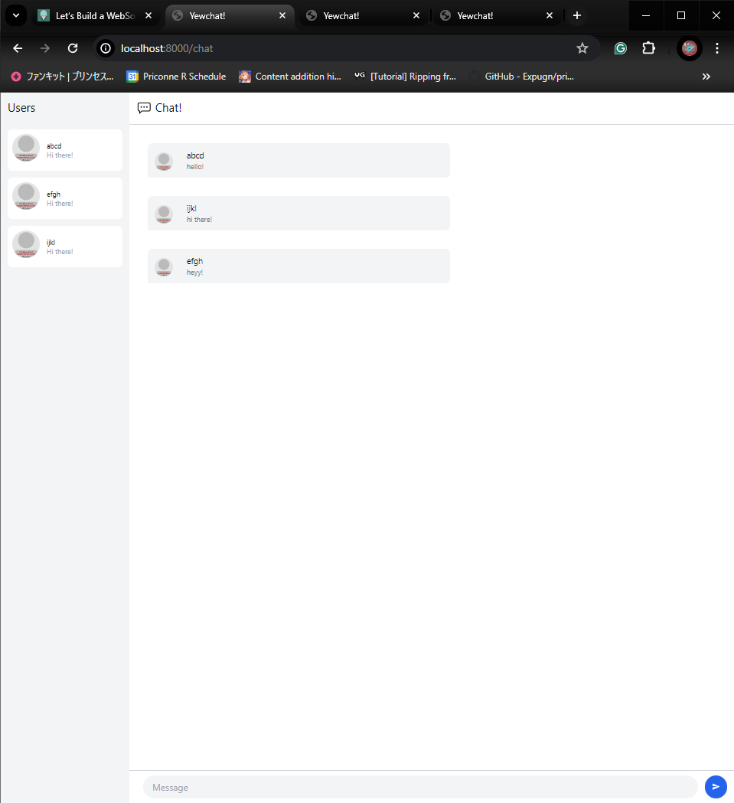
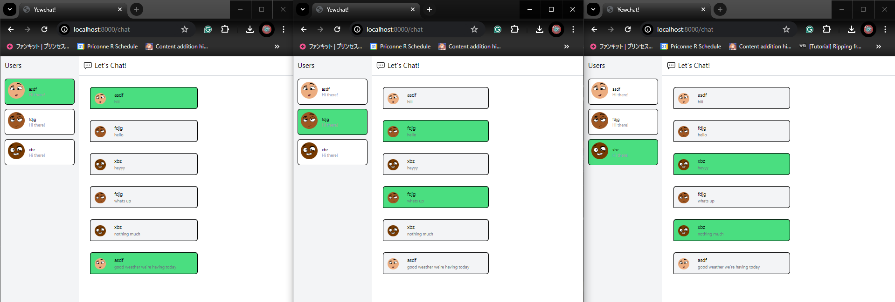

# Module 10 - Yew Chat

## 3.1

Berikut adalah tampilan original dari code yang ada pada blog yang diberikan. Disini terdapat 3 user yang masing-masing telah mengirimkan pesan.

## 3.2

Untuk tambahan kreativitas, saya memilih untuk memberikan *current user* background yang berbeda sehingga kita tahu di sesi ini nama usernya siapa. Saya juga membenarkan link untuk avatar sehingga sekarang avatar akan di generate secara random melalui `DiceBear` (API publik). Selain itu, saya juga menambahkan border pada bagian user dan messages sehingga lebih ketara perbedaannya.
